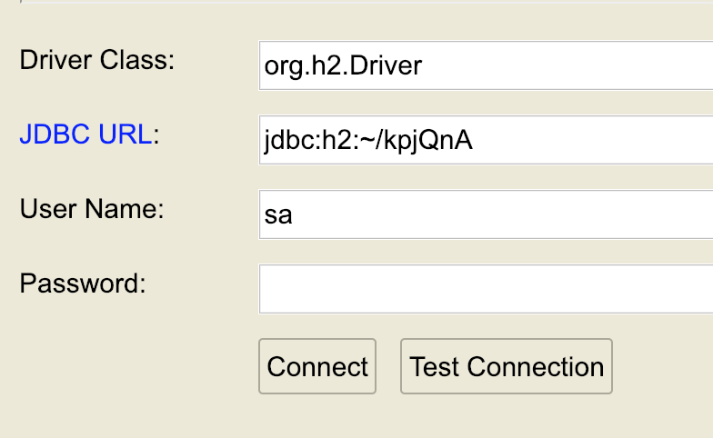
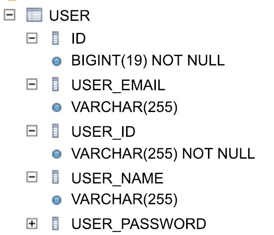
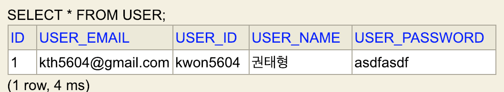
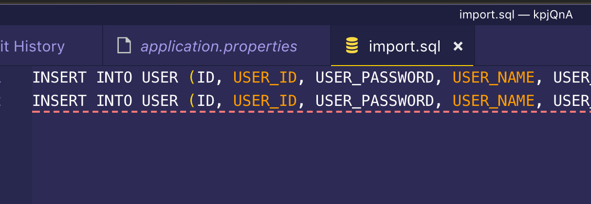

# 자바 웹 어플리케이션 과정 소개

> - 질문 / 답변 웹 서비스를 구현해 가는 전체 과정을 담고 있다.
> - 첫번째 반복 주기부터 로컬 서버 구현에서 원격 서버 배포까지 과정을 담고 있다.
> - 과정을 반복하면서 문제점을 인식하고, 해결책을 찾는 방식으로 진행한다.


> ### **의식적인 연습** 과 **단계적 접근**
>
> > 정신적 능력을 향상시키는 핵심은 단기기억의 한계를 극복하고, **다량의 정보를 한꺼번에 효율적으로 다룰** 수 있게 해주는 **심적 구조물(심적 표상)**을 만들어 내는 것
>
> > 심적 구조물(심적 표상) 이란?
> >
> > - 사물, 관념, 정보, 이외에 구체적이든 추상적이든 **뇌가 생각하고 있는 대상에 상응하는 이미지**
>
> > **"의식적인 연습"**의 핵심목적은 **효과적인 심적 표상을 개발하는 것**이며, 심적 표상은 다시 "의식적인 연습"에서 핵심 역할을 한다.
>
> 
>
> ### 의식적인 연습을 위한 활동
>
> 1. 현재 자신의 수준보다 **한 단계 난이도가 있는 문제**에 **도전**
> 2. **같은 프로그램을 여러 번 반복적으로 구현**, 반복할 때 마다 **다른 방식으로 접근**하기위해 노력한다.
> 3. 주변의 피드백을 최대한 활용한다. **피드백을 받고 개선하는 경험**을 반복해야 한다.
>
> 
>
> ### 연습 방법
>
> - ~~연습 1 - 동영상을 보면서 전체 과정을 성공하는 것에 집중~~
> - <u>연습 2.  동영상을 보면서 각 과정의 중요한 부분을 메모한다.</u>
> - 연습 3. 가능한 동영상을 보지 않고, 메모를 참고해 전체 과정을 진행
> - 연습 4. 메모를 참고하면서 좀 더 추가적으로 학습하고 싶은 내용에 대해 한, 두가지씩 추가학습한 후 정리
> - 자신이 만족하는 수준까지 연습 4를 반복한다.
> - 최종 단계는 메로를 보지 않고도 전체 과정을 성공하도록 한다.
> - 최종 단계 이후에도 연습을 하고 싶다면 시작해서 끝나는 시간을 단축하기 위한 연습을 한다.
> - 이 같은 연습을 익숙해지는 시점까지 매일 일정 시간을 투자한다. 한번에 한 한복주기로 자주하는 것이 좋다.
>
> 
>
> ------
>
> 


> ## 1. 로컬 개발환경 세팅
>
> - spring boot project
>
>   - Web/mustache/dev-tools(변경사항있을 시, 자동 재시작해줌)
>
> - Hello World" welcom 페이지
>
> - live reload chrome extension 설치
>
>   
>
> ### 1.1 Spring Boot 로컬 개발환경 세팅
>
> > 1. ~~Dev-tools(live reload 사용하기위해 필요함), web, mustach dependency 추가~~
> > 2. ~~html 파일 추가해서 Hello world 찍기~~
> > 3. ~~live reload 설치 후 활성화 및 테스트~~
>
> #### 메모
>
> > - Vscode로도 프로젝트 생성이 잘된다.
> > - Vscode 상에서는 프로젝트 실행할 때, java 경로 에러가 떠서, sts로 프로젝트 생성 후에 import 하였음
>
> 
>
> ### 1.2 HTML 페이지 개발
>
> > 1. ~~bootstrap start html 추가~~
> >
> > 1. ~~bootstrap css 라이브러리 추가~~
> >
> > 1. ~~jquery javascript 라이브러리 추가~~
> >
> > 1. ~~index.html => navigation bar 추가~~
> >
> > 1. ~~회원가입 페이지 개발~~
>
> 
>
> #### 메모
>
> > - 크롬 네트워크 부분에서 css, js를 잘 로드해오는지 확인할 수 있다.
> > - mvnrepository.com 을 통해 의존 라이브러리 관리
> > - 의존 라이브러리 추가하고 적용할 때, 서버 재시작 해줘야된다.
>
> 
>
> 
>
> ### 1.3 github에 소스 코드 추가
>
> > 1. ~~sourcetree에 저장소 추가~~ -> vscode로 대체
> > 2. ~~github에 소스 코드 추가~~
>
> 
>
> 
>
> ### 1.4 ~1.6 원격 서버에 소스 코드 배포하기는 생략


---------------


## 반복주기 2 학습 목표

> - 동적인 HTML 웹 페이지 개발
> - Spring MVC의 Model, View, Controller 기반 개발


## 강의 순서

> - 2-1. Controller 추가 및 mustache에 인자 전달
> - 2-2. 회원가입 기능 구현
> - 2-3. 사용자 목록 페이지 구현
> - 2-4. 원격 서버에 소스 코드 배포
> - 2-5. 이전 상태로 원복 후 반복 구현


### 2-1 mustache를 활용한 동적 HTML과 MVC


#### 메모

> * Controller를 추가할 때, 해당 클래스가 Controller인지 의미를 부여하기 위해 애노테이션을 사용한다.
>
>   ```java 
>   @Controller
>   public class WelcomeController {
>       
>   }
>   ```
>
>   
>
> * mustach에 접근하려면 무조건 Controller를 통해야한다
>
>   ```java 
>   @Controller
>   public class WelcomeController {
>       public String welcome() {
>           return "welcome";
>       }
>   }
>   ```
>
>   * wecome 함수가 리턴하는 String 값은 welcome에 맞추어서, **resource/template/welcome.html에 매핑 된다.**
>
>     
>
> * 어떤 url로 요청할 것인지를 명시해줘야한다.
>
>   ```java 
>   @Controller
>   public class WelcomeController {
>       @GetMapping("/helloworld")
>       public String welcome() {
>           return "welcome";
>       }
>   }
>   ```
>   * application.properties 에 다음 설정 값을 추가해줘야 정상 동작한다.
>
>     ```java 
>     spring.mustache.suffix=.html
>     ```
>
> * 브라우저에서 서버로 요청 보낼 떄, parameter 넘기기
>
>   ```java 
>   @Controller
>   public class WelcomeController {
>       @GetMapping("/helloworld")
>       public String welcome(String name) {
>           System.out.println("name : " + name);
>           return "welcome";
>       }
>   }
>   ```
>
>   
>
>   
>
>   
>
>   ```java 
>   @Controller
>   public class WelcomeController {
>       @GetMapping("/helloworld")
>       //Model객체를 매개변수로 지정
>       public String welcome(String name, Model model) {
>           System.out.println("name : " + name);
>   
>           //addAttribute 메소드를 통해서 "name"이라는 이름으로, name 값을 저장
>           //mustach template 상에서 {{name}}으로 접근 할 수 있다.
>           model.addAttribute("name", name);
>           return "welcome";
>       }
>   }
>   ```

#### 잘 모르거나 좀 더 학습이 필요한 것들

> 1. Model 클래스의 addAttribute 메소드에 대해서


### 2-2 회원가입 기능 구현


#### 메모

> * GET , POST 사용
>
>   * GET
>     * 데이터를 가져올 때 쓴다.
>     * 사용자 목록, 특정 회원 정보 등
>   * POST
>     * 서버에 데이터를 전송해서, 새로운 데이터를 추가 혹은 수정 할 떄 사용
>     * 로그인, 회원가입 등
>
> * 넘어가는 매개변수가 너무 길다.
>
> ```java 
> @Controller
> public class UserController {
>    @PostMapping("/create")
>    public String create(String userId, String userPassword, String userName, String userEmail) {
>        System.out.println("userId: " + userId);
>        return "index";
>    }
> }
> ```
>
>   * 각각을 일일이 넘기지 말고, 객체로 넘기면 코드를 깔끔하게 유지할 수 있다.
>
>   * User.java 파일을 따로 만들고, 데이터를 저장할 User class를 생성한다.
>
>   * get,set method를 만들어주고, toString도 만들어 준다. - 자동생성하자
>
>  ```java 
>  package com.example.demo.web;
>  
>  /**
>      * User
>   */
>  public class User {
>  
>      private String userId;
>      private String userPassword;
>      private String userName;
>      private String userEmail;
>  
>      public String getUserId() {
>          return this.userId;
>      }
>  
>      public void setUserId(String userId) {
>          this.userId = userId;
>      }
>  
>      public String getUserPassword() {
>          return this.userPassword;
>      }
>  
>      public void setUserPassword(String userPassword) {
>          this.userPassword = userPassword;
>      }
>  
>      public String getUserName() {
>          return this.userName;
>      }
>  
>      public void setUserName(String userName) {
>          this.userName = userName;
>      }
>  
>      public String getUserEmail() {
>          return this.userEmail;
>      }
>  
>      public void setUserEmail(String userEmail) {
>          this.userEmail = userEmail;
>      }
>  
>      @Override
>      public String toString() {
>          return "{" + " userId='" + getUserId() + "'" + ", userPassword='" + getUserPassword() + "'" + ", userName='"
>                     + getUserName() + "'" + ", userEmail='" + getUserEmail() + "'" + "}";
>      }
>  
>  }
>  ```
>
>  
>
>  기존 UserController.java는 아래와 같이 깔끔하게 코드를 줄일 수 있다.
>
>  ```java 
>  //이렇게 깔끔해진다..
>  
>  @Controller
>  public class UserController {
>      @PostMapping("/create")
>      public String create(User user) {
>          System.out.println("user: " + user);
>          return "index";
>      }
>  }
>  ```
>
>  ```java 
>  user: { userId='kwon5604', userPassword='fv3528no!', userName='sdafasdf', userEmail='kwon5604@naver.com'}
>  ```
>
>     * 더하여서, toString()의 영향으로 위와 같이 깔끔하게 저장하고 있는 유저정보에 대해서 출력까지 해준다.
>
>  
>


### 2-3 사용자 목록 기능 구현


#### 메모

> - 현재는 단순히 출력만 한다.
>
> - 사용자 목록을 보여주려면, 서버에 값을 가지고 있어야 하는데,
>
> - 회원가입한 사용자를 저장할 수 있는 List collection을 사용한다.
>
> - 그러나, 이것은 잠시 메인 메모리에 저장하기 때문에, 서버를 재시작 하면, 데이터가 사라진다.
>
> - 영구적으로 저장할 수 있는 DB가 필요하다.
>
>   ```java 
>   private List<User> users = new ArrayList<User>();private List<User> users = new ArrayList<User>();
>   
>       @PostMapping("/create")
>       public String create(User user) {
>           System.out.println("user: " + user);
>           users.add(user);//users에 user를 추가한다.
>           return "redirect:/list";
>       }
>   ```
>
>   
>
> - 위에서 List collection의 users 가 static이 아니여도 되는 이유
>
>   - Controller 인스턴스가 Spring에 의해 관리되고 있는데, 서버가 동작하는 한 개의 인스턴스가 생성되어 재사용되는 구조
>   - 따라서, 굳이 static을 사용하지 않아도 똑같은 효과를 낸다.
>   - Spring을 사용하는 이유중 하나가 Single 인스턴스 관리를 static을 사용하지 않고 가능하기 때문
>
>   
>
> - 템플릿 반영할 때, 재시작 안하고 반영하기 위한 설정
>
>   ```java 
>   //application.properties
>   handlebars.cache=false
>   ```
>
>   
>
> - mustach 문법 if 문
>
>   ```html
>   {{#users}}
>       <tr>
>           <th scope="row">1</th>
>           <td>{{ userId }}</td>
>           <td>{{ userName }}</td>
>           <td>{{ userEmail }}</td>
>       </tr>
>   {{/users}}
>   ```
>
>   


#### 잘 모르겠는 내용

> 1. Spring을 사용하는 이유중 하나가 Single 인스턴스 관리를 static을 사용하지 않고 가능하기 때문 ???
> 2. Controller 인스턴스가 Spring에 의해 관리되고 있는데, 서버가 동작하는 한 개의 인스턴스가 생성되어 재사용되는 구조???
> 3. Contoller도 Bean 이고 Bean은 기본적으로 싱글톤이기 때문???


### 2-4, 2-5는 생략


-----------


## 반복주기 3 학습 목표

> - 데이터베이스에 사용자 데이터 추가
> - 개인정보 수정 기능 구현
> - 질문하기, 질문목록 기능 구현


## 강의 순서

> - 3-1. QnA HTML 템플릿, H2 데이터베이스 설치, 설정 관리툴 확인
> - 3-2. 자바 객체와 테이블 매핑, 회원가입 기능 구현
> - 3-3  HTML 정리, URL 정리
> - 3-4 개인정보 수정 기능 구현
> - 3-5. 질문하기, 질문목록 기능 구현
> - 3-6. 원격 서버에 소스 코드 배포


### 3-1 QnA HTML 템플릿, H2 데이터베이스 설치, 설정 관리툴 확인


### 메모

> - h2 데이터베이스 설치는 Maven을 통해서 간단히 설치 가능
> - http://localhost:8080/h2-console/ 로 접속
> - h2 데이터베이스 설치 후, pom.xml 에서 <scope>test<scope> 이거 삭제해줘야된다.


### 3-2 자바 객체와 테이블 매핑, 회원가입 기능 구현


### 메모

> * h2 접속 관련
>
>   * Application.properties에 다음 설정 값을 추가
>
>     ```java 
>     spring.datasource.url=jdbc:h2:~/kpjQnA;DB_CLOSE_DELAY=-1;DB_CLOSE_ON_EXIT=FALSE
>     spring.datasource.driverClassName=org.h2.Driver
>     spring.datasource.username=sa
>     spring.datasource.password=
>     spring.jpa.database-platform=org.hibernate.dialect.H2Dialect
>     ```
>
>     ```java 
>     //로그인 할 때 다음 경로로 로그인 한다.
>     jdbc:h2:~/kpjQnA
>     ```
>
>     
>
>   
>
> * jpa 추가 -> Maven Repository에서 추가한다.
>
> * User 클래스에 데이터베이스와 매핑하는 애노테이션을 추가한다.
>
>   ```java 
>   @Entity // User 클래스에 데이터베이스와 매핑하는 애노테이션을 추가
>   public class User {
>       @Id
>       @GeneratedValue
>       private Long id; // @Id로 primary key 지정, @GeneratedValue == Auto Increment
>   
>       @Column(nullable = false) // null 관리
>       private String userId;
>       private String userPassword;
>       private String userName;
>       private String userEmail;
>   ```
>
>   
>
>   * 위와 같이 db 테이블이 만들어진 것을 확인할 수 있다.
>
> * 데이터베이스에 데이터를 조회 혹은 삽입하려면 인터페이스를 만들어야 한다.
>
>   ```java 
>   //UserRepository
>   
>   package com.example.demo.domain;
>   
>   import org.springframework.data.jpa.repository.JpaRepository;
>   
>   // JpaRepository는 User에 대한 repository 이고, 두번쨰는 User의 primary Key 타입 
>   // 기본적으로 데이터베이스에 저장하고, 조회하는 기능 구현은 끝
>   public interface UserRepository extends JpaRepository<User, Long> {
>   
>   }
>   ```
>
> * 만들어진 UserRepository를 쓰기위해서는 @Autowired를 이용해서 땡겨서 쓴다.???
>
>   ```java 
>   @Controller
>   public class UserController {
>       private List<User> users = new ArrayList<User>();
>   
>       //UserRepository 인터페이스를 따로 구현해서 쓰지 않고,
>       //다음과 같이 @Autowired 애노테이션을 이용해서 바로 가져다가 사용한다.
>       @Autowired
>       private UserRepository userRepository;
>   
>       @PostMapping("/create")
>       public String create(User user) {
>           System.out.println("user: " + user);
>           users.add(user);
>           //JpaRepository 내부 어딘가에 save는 구현이 되어있다.
>           userRepository.save(user);// db에 값 추가한다.
>           return "redirect:/list";
>       }
>       //...
>   }
>       
>   ```
>   * 정상적으로 DB에 값이 들어가면, 아래와 같이 보인다.
>
>     
>
>   
>
> * 데이터베이스에서 값 가져오기(유저 리스트)
>
>   ```java 
>    @GetMapping("/list")
>       public String list(Model model) {
>           //List collection 객체 users를 userRepository.findAll()로 교체
>           model.addAttribute("users", userRepository.findAll());
>           return "list";
>       }
>   ```
>
>   


### 잘 모르겠는 내용

> 1. @Autowired에 대해서


### 3-3 HTML 정리, URL 정리


### 메모

> - UserController를 다음과 같이 수정한다.
>
>   ```java 
>   
>   @Controller
>   public class UserController {
>   
>       @Autowired
>       private UserRepository userRepository;
>   
>       @PostMapping("/user/create")
>       public String create(User user) {
>           System.out.println("user: " + user);
>           userRepository.save(user);// db에 값 추가
>           //user폴더에 list.html로 리다이렉팅 한다.
>           return "redirect:/user/list";
>       }
>   
>       @GetMapping("/user/list")
>       public String list(Model model) {
>           model.addAttribute("users", userRepository.findAll());
>           //user 폴더에 list.html로 매핑된다.
>           return "/user/list";
>       }
>   }
>   
>   ```
>
>   
>
> - Controller의 중복을 제거하면, 이와같이 쓸 수도 있다.
>
>   ```java 
>   
>   @Controller
>   // 대표url을 지정함으로써, 중복을 제거한다.
>   @RequestMapping("/users")
>   public class UserController {
>   
>       @Autowired
>       private UserRepository userRepository;
>   
>       @PostMapping("")
>       public String create(User user) {
>           System.out.println("user: " + user);
>           userRepository.save(user);// db에 값 추가
>           return "redirect:/users";
>       }
>   
>       @GetMapping("")
>       public String list(Model model) {
>           model.addAttribute("users", userRepository.findAll());
>           return "/user/list";
>       }
>   }
>   
>   ```
>
> - Mustache 사용해서 html 중복 코드 제거
>
>   ```html
>   {{> /include/navigation}} 
>   
>   //이런 식으로 include 이하에 각각 파트를 나눈 html을 만들고,
>   //위의 방식 대로 넣어주면 된다.
>   ```
>
>   


### 3-4 개인정보 수정 기능 구현-1


### 메모

> - 주소창에서 입력받은 id 값 메소드에 넘길 때
>
>   ```java 
>   @GetMapping("/{id}/form")
>       public String updateForm(@PathVariable Long id, Model model) {
>   
>           // userRepository 상에서 id 값에 해당하는 유저를 user로 넘긴다.
>           model.addAttribute("user", userRepository.findById(id).get());
>           return "/user/updateForm";
>       }
>   ```
>
>   * @PathVariable을 사용한다.


### 3-5 개인정보 수정 기능 구현-2


### 메모

> * Put 사용시
>
>   ```java 
>   <input type="hidden" name="_method" value="put" />
>   ```
>
>   * 를 form 아래에 추가해주면 된다.
>
>   ```java 
>   @PutMapping("/{id}")
>       public String update(@PathVariable Long id, User newUser) {
>   
>           // 수정할 사용자의 id 값과 수정할 newUser User객체를 받는다.
>           User user = userRepository.findById(id).get();
>           // newUser 객체는 update를 통해서 새롭게 set 된다.
>           user.update(newUser);
>           // 바뀐 객체를 저장한다. -> 수정 완료
>           userRepository.save(user);
>           return "redirect:/users";
>       }
>   ```
>
>   


### 3-6 원격지 배포 생략


----------


## 반복주기 4 학습 목표

> - 로그인 기능 구현을 통한 쿠키와 세션에 대한 대략적인 이해
> - 로그인 사용자에 대한 접근 제한


## 강의 순서

> - 4-1. 로그인 기능 구현
> - 4-2. 로그인 상태에 따른 메뉴 처리 및 로그 아웃
> - 4-3.  로그인 사용자에 한해 자신의 정보를 수정하도록 수정
> - 4-4. 질문하기, 질문목록 기능 구현
> - 4-5. 원격 서버에 소스 코드 배포


### 4-1 로그인 기능 구현


### 메모

> - 로그인 세션 유지 관련
>
>   ```java 
>    @PostMapping("/login")
>       public String login(String userId, String userPassword, HttpSession session) {
>   
>           // userId로 찾고 싶을 때, 그러나, 현재 pk는 Long id 값이다.
>           // userId 기반으로 찾고 싶다면?
>           // userRepository Interface에 findeByuserId관련 설정해야한다.
>           User user = userRepository.findByUserId(userId);
>   
>           // 1. userId에 해당하는 유저가 존재해야한다.
>           // 아닐 시 loginForm으로 리다이렉팅한다.
>           if (user == null) {
>               System.out.println("Login Failed!");
>               return "redirect:/users/loginForm";
>           }
>   
>           // 2. 입력받은 userPassword가 저장되어있는 password와 같아야 한다.
>           // 아닐 시 loginForm으로 리다이렉팅한다.
>           if (!userPassword.equals(user.getUserPassword())) {
>               System.out.println("Login Failed!");
>               return "redirect:/users/loginForm";
>           }
>   
>           // 3.세션을 등록한다
>           System.out.println("Login Success!");
>           session.setAttribute("user", user);
>   
>           return "redirect:/";
>   ```
>
>   ```java 
>   public interface UserRepository extends JpaRepository<User, Long> {
>       // 이를 통해 userId를 통해서 유저를 찾을 수 있다.
>       User findByUserId(String userId);
>   }
>   ```
>
> - 언어 선택 문제 
>
>   ```json
>   "files.associations": {
>       "*.html": "html"
>     }
>   ```
>
>   


### 4-2 로그인 상태에 따른 메뉴 처리 및 로그아웃


### 메모

> * 데이터베이스 초기화 방법
>
>   > 1. /resources/import.sql 파일을 생성한다.
>   >
>   > 2. Insert 쿼리를 통해 값을 넣는다.
>   >
>   >    
>
> * session을 모델에 담아서 mustach에 넘기는 법
>
>   ```java 
>   //설정을 해준다.
>   spring.mustache.expose-session-attributes=true
>   ```
>
> * 로그아웃
>
>   ```java 
>   @GetMapping("/logout")
>       public String logout(HttpSession session) {
>           session.removeAttribute("user");
>           return "redirect:/";
>       }
>   ```
>
>   


### 

### 4-3 자기 자신에 한해 개인정보 수정


### 메모

```java 
@GetMapping("/{id}/form")
    public String updateForm(@PathVariable Long id, Model model, HttpSession session) {
        
        //이 부분부터 코드가 추가되었다.
        //세션으로 부터 sessionedUser에 해당하는 session 값을 받는다.
        Object tempUser = session.getAttribute("sessionedUser");
        
        //이때 해당 세션 값이 null이면, loginForm으로 리다이렉팅 하고,
        if (tempUser == null) {
            return "redirect:/users/loginForm";
        }
        
        //null이 아닐 시에는, 자신의 정보만 수정할 수 있도록 예외처리를 해준다.
        User sessionedUser = (User) tempUser;
        if (!id.equals(sessionedUser.getId())) {
            throw new IllegalStateException("자신의 정보만 수정할 수 있습니다.");
        }

        // userRepository 상에서 id 값에 해당하는 유저를 user로 넘긴다.
        model.addAttribute("user", userRepository.findById(sessionedUser.getId()).get());
        return "/user/updateForm";
    }
```


### 4-4 중복 제거, clean code, 쿼리 보기 설정


### 메모

#### 중복코드 제거

```java 
package com.example.demo.web;

import javax.servlet.http.HttpSession;

import com.example.demo.domain.User;

public class HttpSessionUtils {

    //USER_SESSION_KEY 라는 공통적으로 사용하는 변하지않는 변수를 지정한다.
    public static final String USER_SESSION_KEY = "sessionedUser";

    //로그인 여부를 확인하는 메소드
    public static boolean isLoginUser(HttpSession session) {
        //세션정보를 받아와서 세션 정보가 없으면 false, 있으면 true를 반환한다.
        Object sessionedUser = session.getAttribute(USER_SESSION_KEY);

        if (sessionedUser == null) {
            return false;
        }
        return true;
    }

    //세션으로부터, 로그인한 사용자의 정보를 가져온다.
    //로그인 세션이 확인 되면 세션에 해당하는 유저정보를 리턴한다.
    public static User getUserFromSession(HttpSession session) {
        if (!isLoginUser(session)) {
            return null;
        }
        return (User) session.getAttribute(USER_SESSION_KEY);
    }

}
```

```java 
//getPassword 혹은 getId를 통해서 객체에 저장된 값을 불러내지 말고,
//객체를 최대한 활용해서, 객체내에서 확인할 수 있는 것은 확인해서 리턴값으로 확인하도록 하자.

public boolean matchPassword(String newPassword) {
        if (newPassword == null) {
            return false;
        }
        return newPassword.equals(userPassword);
    }

 public boolean matchId(Long newId) {
        if (newId == null) {
            return false;
        }

        return newId.equals(id);
    }
```

```java 
@GetMapping("/{id}/form")
    public String updateForm(@PathVariable Long id, Model model, HttpSession session) {
        //로그인 유저 세션 확인
        if (HttpSessionUtils.isLoginUser(session)) {
            return "redirect:/users/loginForm";
        }
        
        //로그인 유저에 대해서 id 값이 일치하는지 확인
        User sessionedUser = HttpSessionUtils.getUserFromSession(session);
        if (!sessionedUser.matchId(id)) {
            throw new IllegalStateException("자신의 정보만 수정할 수 있습니다.");
        }

        // userRepository 상에서 id 값에 해당하는 유저를 user로 넘긴다.
        model.addAttribute("user", userRepository.findById(sessionedUser.getId()).get());
        return "/user/updateForm";
    }
```

```java 
//쿼리 콘솔창에 보이도록 설정
spring.jpa.show-sql=true
spring.jpa.properties.hibernate.format_sql=true
```


 

### 4-5 질문하기, 질문목록 구현

### 메모

```java 
@Controller
@RequestMapping("/questions")
public class QuestionController {

    @Autowired
    private QuestionRepository questionRepository;

    @GetMapping("/form")
    public String form(HttpSession session) {

        // 질문 하기에 접근할 떄,
        // 유저의 로그인 세션이 존재하지 않는다면, loginFrom으로 리다이렉팅 한다.
        if (!HttpSessionUtils.isLoginUser(session)) {
            return "/users/loginForm";
        }
        // 유저의 로그인 세션이 존재 한다면,
        return "/qna/form";
    }

    @PostMapping("")
    public String create(String title, String contents, HttpSession session) {
        // 유저의 로그인 세션이 존재하지 않는다면, loginFrom으로 보낸다.
        if (!HttpSessionUtils.isLoginUser(session)) {
            return "/users/loginForm";
        }

        // 세션으로 부터 유저를 불러온다.
        User sessionUser = HttpSessionUtils.getUserFromSession(session);
        // form으로 부터 받은 정보와 로그인 된 세션정보를 인자로 넘겨주어서, Question 객체를 생성한다.
        Question newQuestion = new Question(sessionUser.getUserId(), title, contents);
        // 생성한 Question 객체를 DB에 save 한다.
        questionRepository.save(newQuestion);

        return "redirect:/";
    }

}
```


## 반복주기 5 학습 목표

> - 객체 간의 관계 설정(@OㄷneToMany, @ManyToMany)


## 강의 순서

> - 5-1. 회원과 질문 간의 관계 매핑 및 리팩토링
> - 5-2. 질문 상세보기 기능 구현
> - 5-3. 질문 수정 기능 구현
> - 5-4. 수정 삭제에 대한 보안 처리및 LocalDateTIme 설정
> - 5-5. 답변 추가 및 답변 목록 기능 구현
> - 5-6. haspermission과 Result 를 이용한 Exception 처리 및 리팩토링
> - 5-7. 원격 서버에 소스 코드 배포

### 

### 5-1. 회원과 질문 간의 관계 매핑 및 리팩토링

### 메모


#### create 컬럼 추가하기

```java 
package com.example.demo.domain;

import java.time.LocalDateTime;
import java.time.format.DateTimeFormatter;

import javax.persistence.Entity;
import javax.persistence.GeneratedValue;
import javax.persistence.Id;
import javax.persistence.JoinColumn;
import javax.persistence.ManyToOne;
import javax.persistence.ForeignKey;

//Question 모델 생성
@Entity
public class Question {

    @Id
    @GeneratedValue
    private Long id;

    //유저 한명에 대해서 질문은 여러개 있기 때문에 writer에 대한 질문:유저 ManyToOne관계를 해주고,
    @ManyToOne
    //외래키 이름을 아래와 같이 지정해 줄 수 있다.
    @JoinColumn(foreignKey = @ForeignKey(name = "fk_question_writer"))
    private User writer;
    private String title;
    private String contents;

    // 질문 생성시간를 위한 컬럼 추가
    private LocalDateTime createDate;

    public Question() {

    }

    public Question(User writer, String title, String contents) {
        this.writer = writer;
        this.title = title;
        this.contents = contents;
        // 생성시간을 현재시간으로 초기화
        this.createDate = LocalDateTime.now();
    }

    // 생성된 시간에 대한 formatted get 메소드 작성
    // template 에서 {{ formattedCreateDate }} 로 사용 가능 하다
    public String getFormattedCreateDate() {
        if (createDate == null) {
            return "";
        }
        return createDate.format(DateTimeFormatter.ofPattern("yyyy.MM.dd HH:mm"));
    }
}
```


### 5-2. 질문 상세보기 기능 구현

### 메모

```java 
@GetMapping("/{id}")
    public String show(@PathVariable Long id, Model model) {
        model.addAttribute("question", questionRepository.findById(id).get());
        return "/qna/show";
    }
```


### 5-3. 질문 수정 기능 구현

### 메모

```java 
// updateForm에 질문 객체를 전달한다.
    @GetMapping("/{id}/form")
    public String updateForm(@PathVariable Long id, Model model) {
        model.addAttribute("question", questionRepository.findById(id).get());
        return "/qna/updateForm";
    }

    // form으로 부터 전달받은 값을 통해서, 디비 값을 update 한다.
    @PutMapping("/{id}")
    public String update(@PathVariable Long id, String title, String contents) {
        Question question = questionRepository.findById(id).get();
        question.update(title, contents);
        questionRepository.save(question);
        return String.format("redirect:/questions/%d", id);
    }
	//삭제!
    @DeleteMapping("/{id}")
    public String delete(@PathVariable Long id) {
        questionRepository.deleteById(id);
        return "redirect:/";
    }
```


### 5-4. 수정 삭제에 대한 보안 처리및 LocalDateTIme 설정


### 메모

```java 
 public boolean isSameWriter(User loginUser) {
     	//User 객체끼리 비교하는 것이기 때문에, User.java에서 equals를 만들어줘야 정상동작한다.
        System.out.println("==========isSameWrite==========");
        System.out.println(loginUser.getId());
        System.out.println(this.writer.getId());
        System.out.println("==========isSameWrite==========");
        return this.writer.equals(loginUser);
    }
```


### 5-5 답변추가 및 답변 목록 기능 구현


### 메모

```java 
@PostMapping("")
    public String create(@PathVariable Long questionId, String contents, HttpSession session) {
        if (!HttpSessionUtils.isLoginUser(session)) {
            return "/users/loginForm";
        }
        //로그인 유저 객체
        User loginUser = HttpSessionUtils.getUserFromSession(session);
        //인자로 받은 questionId 값에 해당하는 질문
        Question question = questionRepository.findById(questionId).get();
        //로그인 유저와, 질문, form으로 부터 받은 값을 넘겨서 Answer 객체를 생성한다.
        Answer answer = new Answer(loginUser, contents, question);

        //Answer DB에 저장한다.
        answerRepository.save(answer);

        return String.format("redirect:/questions/%d", questionId);
```

```java 
//Question.java
...
//oneToMany로 answer들을 받아서 리스트 형태로 가진다.    
@OneToMany(mappedBy = "question")
    @OrderBy("id ASC")
    private List<Answer> answers;

...
```

```java 

...
//답글은 사용자에 대해서도 ManyToOne, 질문에 대해서도 ManyToOne의 관계를 가지기 떄문에
    //아래와 같이 모두 외래키 설정 해주어야 한다.
    @ManyToOne
    @JoinColumn(foreignKey = @ForeignKey(name = "fk_answer_writer"))
    private User writer;

    @ManyToOne
    @JoinColumn(foreignKey = @ForeignKey(name = "fk_answer_to_question"))
    private Question question;

...
```


### 5-6 haspermission과 Result 를 이용한 Exception 처리 및 리팩토링

### 메모

이 강좌에서는 예외처리하는 방법을 아래와 같이 두가지로 사용하였다.

두가지 모두 깔끔하게 잘 처리한 것 같다. 코드를 보고 익힐 필요가 있을 것 같다.

```java 

@GetMapping("/{id}/form")
    public String updateForm(@PathVariable Long id, Model model, HttpSession session) {
        // try catch를 통해서 아래 hasPermission을 이용해서 다시 리팩토링 한다.
        // hasPermission이 true이면 정상 작동하고, hasPermission에서 throw가 발생하면, catch로 넘어간다.
        try {
            Question question = questionRepository.findById(id).get();
            hasPermission(session, question);
            model.addAttribute("question", question);
            return "/qna/updateForm";
        } catch (IllegalStateException e) {
            model.addAttribute("errorMessage", e.getMessage());
            return "/user/login";
        }
    }

    // 기존에 로그인여부와, 본인이 쓴글에 대한 확인 부분을 하나의 메소드로 합친다.
    // 모두 통과 시 true를 반환하고, 그렇지 않을 시에는 throw를 던진다.
    private boolean hasPermission(HttpSession session, Question question) {
        if (!HttpSessionUtils.isLoginUser(session)) {
            throw new IllegalStateException("로그인이 필요합니다!");
        }

        User loginUser = HttpSessionUtils.getUserFromSession(session);
        if (!question.isSameWriter(loginUser)) {
            throw new IllegalStateException("자신이 쓴 글만 수정, 삭제 가능합니다.");
        }
        return true;
    }
```


```java 
@GetMapping("/{id}/form")
    public String updateForm(@PathVariable Long id, Model model, HttpSession session) {
        Question question = questionRepository.findById(id).get();
        
        //valid check를 한다.
        //로그인 체크를 위해 session 객체를, 자신이 쓴 글인지를 확인하기 위해서 question 객체를 넘긴다.
        Result result = valid(session, question);

        //result의 결과가 유효하지 않다면,
        //error 메세지를 loginpage로 보낸다.
        if (!result.isValid()) {
            model.addAttribute("errorMessage", result.getErrorMessage());
            return "/user/login";
        }
        //result의 결과가 유효하다면,
        //정상적으로 동작시킨다.
        model.addAttribute("question", question);
        return "/qna/updateForm";
    }

    private Result valid(HttpSession session, Question question) {
        if (!HttpSessionUtils.isLoginUser(session)) {
            return Result.fail("로그인이 필요합니다.");
        }

        User loginUser = HttpSessionUtils.getUserFromSession(session);
        if (!question.isSameWriter(loginUser)) {
            return Result.fail("자신이 쓴 글만 수정, 삭제 가능합니다.");
        }
        return Result.ok();
    }
```

```java 
//Result.java
package com.example.demo.domain;

public class Result {

    private boolean valid;
    private String errorMessage;

    private Result(boolean valid, String errorMessage) {
        this.valid = valid;
        this.errorMessage = errorMessage;
    }

    public boolean isValid() {
        return valid;

    }

    public String getErrorMessage() {
        return errorMessage;

    }

    public static Result ok() {
        return new Result(true, null);
    }

    public static Result fail(String errorMessage) {
        return new Result(false, errorMessage);
    }
}
```


## 반복주기 6 학습 목표

> - JSON API 및 AJAX를 활용해 답변 추가 / 삭제 구현


## 강의 순서

> - 6-1. AJAX를 활용해 답변 추가 기능 구현
> - 6-2. AJAX를 활용해 답변 추가 기능 구현 2
> - 6-3. AJAX를 활용해 답변 삭제 기능 구현
> - 6-4. 질문 목록에 답변 수 보여주기 기능 추가
> - 6-5. 중복 제거 및 리팩토링
> - 6-6. JSON API 추가 및 테스트
> - 6-6. 쉘 스크립트를 활용해 배포 자동화


### 6-1. Ajax를 활용해 답변 추가 기능 구현

###  메모

```java 
//scripts.js

//class 명이 answer-write인 것의 input type이 submit이 클릭되었을 때, addAnswer함수를 실행한다.
$(".answer-write input[type=submit]").click(addAnswer);

function addAnswer(e) {
  e.preventDefault();
  console.log("click me");

  //addAnser함수는 form에서 전달된 값을 serialize()하여서,
  //key,value형태로 내보난다. -> 여기선 ex) contents=abcde
  var queryString = $(".answer-write").serialize();
  console.log("query:" + queryString);

  //class 명이 answer-write인 태그의 action부분을 가져온다.
  var url = $(".answer-write").attr("action");
  console.log(url);

  //위에서 저장한 url에 대해서, ajax 콜을 한다.
  //위의 url을 post 형식으로 data를 body에 실어서 요청했을 때, 응답 값을 json으로 받는다.
  $.ajax({
    type: "post",
    url: url,
    data: queryString,
    dataType: "json",
    error: onError,
    success: onSuccess,
  });

  function onError() {}
  function onSuccess(data, status) {
    console.log(data);
  }
}
```


```java

//ApiAnswerController.java

//기존의 파일명을 접두어로Api를 붙인 형태로 바꾼다.
//Json 응답을 하기 때문에 Controller를 RestController로 바꿔준다.
@RestController
@RequestMapping("/api/questions/{questionId}/answers")
public class ApiAnswerController {

    @Autowired
    private AnswerRepository answerRepository;

    @Autowired
    private QuestionRepository questionRepository;

    //메소드의 반환형이 Answer 객체이다.
    @PostMapping("")
    public Answer create(@PathVariable Long questionId, String contents, HttpSession session) {
        if (!HttpSessionUtils.isLoginUser(session)) {
            return null;
        }
        // 로그인 유저 객체
        User loginUser = HttpSessionUtils.getUserFromSession(session);
        // 인자로 받은 questionId 값에 해당하는 질문
        Question question = questionRepository.findById(questionId).get();
        // 로그인 유저와, 질문, form으로 부터 받은 값을 넘겨서 Answer 객체를 생성한다.
        Answer answer = new Answer(loginUser, contents, question);

        //저장하는 answer 객체를 리턴한다.
        //이때 클라이언트로 가는 json 응답은 Answer 객체에서 getter 메소드가 구현되어있거나,
        //따로 지정해준것에 한해서, 응답이 보내진다.
        return answerRepository.save(answer);
    }
```


### 6-2. AJAX를 활용해 답변 추가 기능 구현 2

### 메모

```java 
function onSuccess(data, status) {
    
    //show.html 상에, 미리 만들어 놓은 answerTemplate을 불러온다.
    var answerTemplate = $("#answerTemplate").html();

    //불러온 answerTemplate에 format에 맞춰서, 순서대로을 넘긴다.
    var template = answerTemplate.format(
      data.writer.userId,
      data.formattedCreateDate,
      data.contents,
      data.id,
      data.id
    );

    //위에서 만든 template을 앞에다 붙인다.
    $(".qna-comment-slipp-articles").prepend(template);
    //textarea는 공백으로 해준다.
    $(".answer-write textarea").val("");
  }
```

```java 
@JsonProperty를 통해서 JSON 객체로 응답보낼 것을 선택할 수 있다.
```


### 6-3. AJAX를 활용해 답변 삭제 기능 구현

### 메모

```java 
//ApiAnswerController.java

//기존 방식대로, Delete 함수를 만든다.
@DeleteMapping("/{id}")
    public Result delete(@PathVariable Long questionId, @PathVariable Long id, HttpSession session) {
        System.out.println("KwontaeHyoung!");
        if (!HttpSessionUtils.isLoginUser(session)) {
            return Result.fail("로그인해야합니다.");
        }

        Answer answer = answerRepository.findById(id).get();
        User loginUser = HttpSessionUtils.getUserFromSession(session);

        if (!answer.isSameWriter(loginUser)) {
            return Result.fail("사용자 정보가 일치하지 않습니다.");
        }

        answerRepository.deleteById(id);
        return Result.ok();

    }
```

```java 
//scripts.js

//a 태그의 link-delete-article 클래스를 클릭했을 때,
//deleteAnswer 함수를 실행한다.
$("a.link-delete-article").click(deleteAnswer);

function deleteAnswer(e) {
  e.preventDefault();
  //$(this)를 따로 빼놓는다.
  var deleteBtn = $(this);

  //해당 버튼의 url을 변수로 저장한다.
  var url = $(this).attr("href");

  //ajax 요청을 보낸다.
  //typedms delete로 위에서 저장한 url로 보낸다.
  //해당 url을 호출하면서, ApiAnswerController.java의 코드를 통해 디비에서는 삭제된다.
  $.ajax({
    type: "delete",
    url: url,
    dataType: "json",
    error: function(xhr, status) {
      console.log("error");
    },
    //성공 했을 시,
    success: function(data, status) {
      //값이 유효하다면,
      if (data.valid) {
        //위 버튼에서 가장 가까운 article을 찾아서, 삭제한다.
        deleteBtn.closest("article").remove();
      } else {
        //유효하지 않다면, 에러 메세지를 보낸다.
        alert(data.errorMessage);
      }
    },
  });
}
```


### 6-4. 질문 목록에 답변수 보여주기 기능

```java 
//Question.java
@JsonProperty
    private Integer countOfAnswer;

...
    
public void addAnswer() {
        this.countOfAnswer += 1;
    }

    public void minusAnswer() {
        this.countOfAnswer -= 1;
    }

...
```

* question.java에 countOfAnswer 컬럼을 추가한다.
* 게시글이 하나 추가될 때마다, 값을 하나씩 올리고,
* 반대로 감소될때 마다 값을 하나씩 줄인다.


```java 
@DeleteMapping("/{id}")
    public Result delete(@PathVariable Long questionId, @PathVariable Long id, HttpSession session) {
       ....
        answerRepository.deleteById(id);
        //삭제 이후, 아래와 같이 감소연산 후, 다시 객체를 save 해준다.
        Question question = questionRepository.findById(questionId).get();
        question.minusAnswer();
        questionRepository.save(question);
        
        return Result.ok();

    }
```


### 6-5. 중복제거 및 리팩토링

### 메모

```java 


@MappedSuperclass
// 데이터 변경사항 변경시 해당되는 날짜시간을 자동으로 입력해준다.
@EntityListeners(AuditingEntityListener.class)
public class AbstractEntity {
    @Id
    @GeneratedValue(strategy = GenerationType.AUTO)
    @JsonProperty
    private Long id;

    @CreatedDate
    private LocalDateTime createDate;
    @LastModifiedDate
    private LocalDateTime modifiedDate;

    public Long getId() {
        return this.id;
    }

    // 생성된 시간에 대한 formatted get 메소드 작성
    // template 에서 {{ formattedC reateDate }} 로 사용 가능 하다
    public String getFormattedCreateDate() {
        return getFormattedDate(createDate, "yyyy.MM.dd HH:mm");
    }

    public String getModifiedDate() {
        return getFormattedDate(modifiedDate, "yyyy.MM.dd HH:mm");
    }

    private String getFormattedDate(LocalDateTime dateTime, String format) {
        if (dateTime == null) {
            return "";
        }
        return dateTime.format(DateTimeFormatter.ofPattern(format));
    }

    @Override
    public boolean equals(Object o) {
        if (o == this)
            return true;
        if (!(o instanceof AbstractEntity)) {
            return false;
        }
        AbstractEntity abstractEntity = (AbstractEntity) o;
        return Objects.equals(id, abstractEntity.id);
    }

    @Override
    public int hashCode() {
        return Objects.hashCode(id);
    }

    @Override
    public String toString() {
        return "{" + " id='" + id + "'" + ", createDate='" + createDate + "'" + ", modifiedDate='" + modifiedDate + "'"
                + "}";
    }

}
```

* AbstractEntity.java 클래스를 추가해서, 클래스에서 공통적인 부분을 부모클래스로 뽑는다.


```java 
@SpringBootApplication
//아래 설정이 필요
@EnableJpaAuditing
public class KpjQnAApplication {

	public static void main(String[] args) {
		SpringApplication.run(KpjQnAApplication.class, args);
	}

}
```


### 6-6. Swagger 라이브러리를 통한 API 문서화 및 테스트


